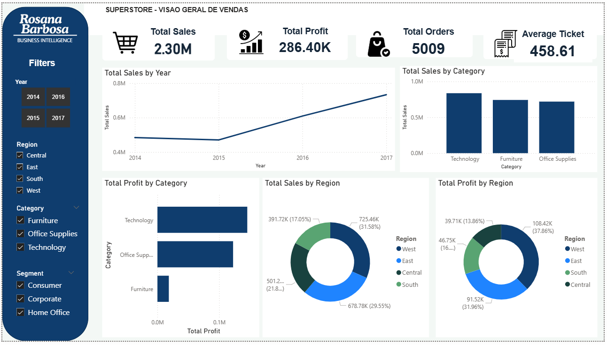

# 📊 Superstore Sales Analysis

## 📌 Project Objective
The objective of this project was to analyze sales data from the Superstore dataset in order to identify patterns, trends, and potential opportunities for improving business performance.

The analysis focused on key metrics such as revenue, profit, number of orders, and average ticket, as well as performance across product categories, regions, and time periods.

---

## 📈 Results
The analysis revealed a consistent growth in sales over the years, indicating a positive evolution of the business.

The **Technology** category stood out as the most profitable, while **Furniture**, despite having strong sales, showed lower profit margins, suggesting possible issues with costs or pricing strategy.

From a regional perspective, **West** and **East** performed the best, while **Central** and **South** showed opportunities for improvement.

The dashboard enables quick visualization of these insights, supporting strategic decision-making.

---

## 🛠️ Tools Used
- Python (Pandas, Matplotlib) → data cleaning and analysis  
- Power BI → interactive dashboard creation  
- GitHub → version control and project documentation  

---

## 🎯 What I Learned
- Data manipulation and cleaning using Python (Pandas)  
- Exploratory Data Analysis (EDA)  
- Data visualization techniques  
- Building interactive dashboards in Power BI  
- Creating metrics and KPIs  
- Dashboard design and layout organization  
- Turning data into actionable business insights  

---

## 🔧 Future Improvements
- Add comparative analysis (e.g., year-over-year performance)  
- Include sales forecasting models  
- Improve visual design and dashboard consistency  
- Integrate additional data sources  
- Create more advanced business indicators  

---

# 📚 Extras

## 📝 Project Description
This project focuses on analyzing the Superstore dataset using Python for data exploration and Power BI for building an interactive dashboard.

The main goal was to transform raw data into meaningful insights to support business decision-making.

---

## ⚙️ Methodology
1. Data collection  
2. Data cleaning and preprocessing using Python  
3. Exploratory Data Analysis (EDA)  
4. Creation of metrics and KPIs  
5. Dashboard development in Power BI  
6. Insights interpretation  

---

## ▶️ How to Run the Project
1. Clone this repository  
2. Open the dataset file (.csv)  
3. Run the Python script for data preprocessing  
4. Open the Power BI file (.pbix)  
5. Interact with the dashboard  

# 📊 Superstore Sales Analysis

## 📌 Objetivo do Projeto
O objetivo deste projeto foi analisar os dados de vendas da base Superstore, com o intuito de identificar padrões, tendências e oportunidades de melhoria no desempenho do negócio.

A análise foi focada em métricas-chave como faturamento, lucro, quantidade de pedidos e ticket médio, além de explorar resultados por categoria de produto, região e período de tempo.

---

## 📈 Resultado
A análise revelou um crescimento consistente nas vendas ao longo dos anos, indicando uma evolução positiva do negócio.

A categoria **Technology** destacou-se como a mais lucrativa, enquanto a categoria **Furniture** apresentou menor margem de lucro, sugerindo possíveis problemas de custo ou precificação.

Regionalmente, as regiões **West** e **East** apresentaram melhor desempenho, enquanto **Central** e **South** mostraram potencial de melhoria.

O dashboard desenvolvido permite visualizar rapidamente esses insights, facilitando a tomada de decisão estratégica.

---

## 🛠️ Ferramentas Utilizadas
- Python (Pandas, Matplotlib) → tratamento e análise de dados  
- Power BI → criação de dashboard interativo  
- GitHub → versionamento e documentação do projeto  

---

## 🎯 O que eu aprendi
- Manipulação e tratamento de dados com Python (Pandas)  
- Análise exploratória de dados (EDA)  
- Criação de visualizações para análise  
- Desenvolvimento de dashboards interativos no Power BI  
- Criação de métricas e KPIs  
- Organização de layout e design de dashboards  
- Transformação de dados em insights para tomada de decisão  

---

## 🔧 Melhorias Futuras
- Adicionar análises comparativas (ex: ano anterior)  
- Incluir previsão de vendas (forecast)  
- Melhorar a identidade visual do dashboard  
- Integrar novas fontes de dados  
- Criar mais indicadores estratégicos  

---

# 📚 Extras

## 📝 Descrição do Projeto
Este projeto consiste na análise de dados da base Superstore, utilizando Python para exploração inicial e Power BI para construção de dashboards interativos.

O foco foi transformar dados brutos em informações estratégicas para apoiar decisões de negócio.

---

## ⚙️ Metodologia
1. Coleta dos dados  
2. Limpeza e tratamento com Python  
3. Análise exploratória (EDA)  
4. Criação de métricas e KPIs  
5. Desenvolvimento do dashboard no Power BI  
6. Interpretação dos resultados  

---

## ▶️ Como Executar o Projeto
1. Clonar este repositório  
2. Abrir o arquivo de dados (.csv)  
3. Executar o script Python para tratamento dos dados  
4. Abrir o arquivo do Power BI (.pbix)  
5. Interagir com o dashboard  
